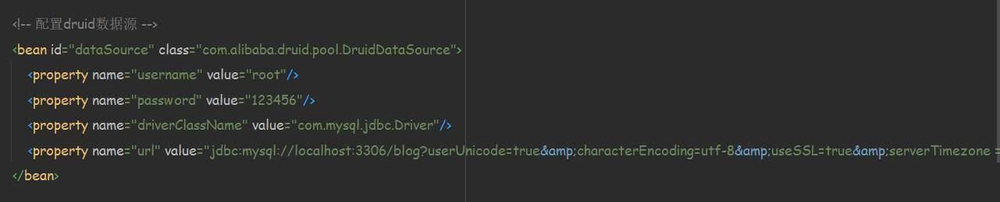

# 基于SSM的博客系统
## 使用技术栈
- Spring
- SpringMVC
- MyBatis
- 国际化框架
- shrio校验框架
- jsp技术
## 开发工具
- IDEA
## 运行环境
- tomcat
## 项目搭建
- clone至本地，加载完成pom中的所有依赖
- 修改tomcat配置，如图所示

  
- 将src/main/resources/sql下的sql文件在数据库管理工具中运行创建好数据库
- 修改application-content.xml中的druid数据源，如下图所示

- 运行程序，访问localhost:8080即可查看页面，如图所示
- 演示登录的账号密码均为admin

## Star

